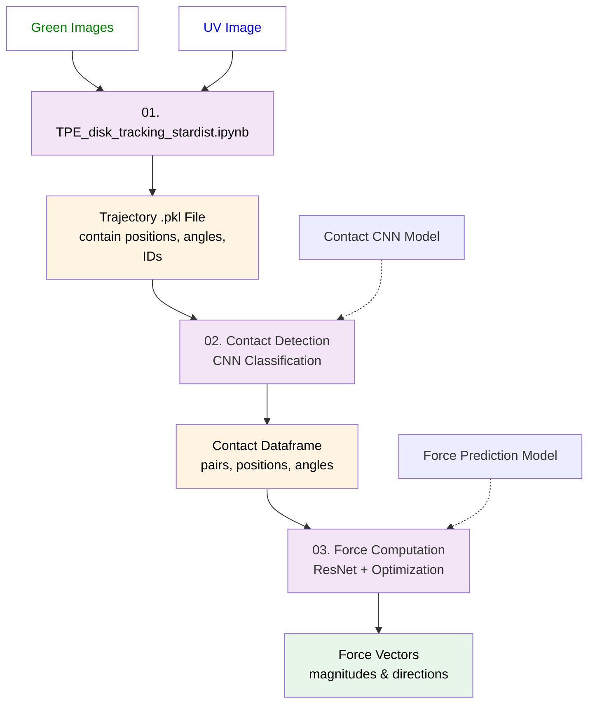

# TPE Disk Image Processing

This repository contains a three-step image analysis pipeline for tracking photoelastic disks, detecting contacts, and computing force vectors in granular material experiments.

## Workflow Overview

The analysis pipeline consists of three sequential notebooks that process experimental images to extract particle trajectories and force networks:



## Pipeline Steps

### Step 1: Disk Tracking with StarDist
**Notebook:** `01. TPE_disk_tracking_stardist.ipynb`

This notebook performs automated detection and tracking of photoelastic disks throughout the experiment.

**Key Features:**
- Camera alignment correction
- Disk detection using pre-trained StarDist2D model
- Particle linking into trajectories using Trackpy
- Rotation angle computation via PCA on disk orientation markers
- Boundary particle identification

**Inputs:**
- Raw experimental images (polarized light images)
- StarDist model for disk segmentation

**Outputs:**
- Pickle file containing:
  - Particle positions (x, y) for each frame
  - Particle IDs and trajectories
  - Disk radii (rpx)
  - Rotation angles
  - Boundary particle flags

### Step 2: Contact Detection
**Notebook:** `02. TPE_contact_detect.ipynb`

Identifies and classifies contacts between particles using a trained CNN model.

**Key Features:**
- Neighbor detection based on distance threshold
- Contact classification using neural network
- Removal of duplicate contact pairs
- Visualization of contact network

**Inputs:**
- Trajectory pickle file from Step 1
- Raw images
- Pre-trained contact detection model

**Outputs:**
- Contact dataframe with:
  - Contact pairs (i, j)
  - Contact positions (xi, yi, xj, yj)
  - Contact angles (beta)
  - Classification scores

### Step 3: Force Vector Computation
**Notebook:** `03. TPE_solve_force_vector_with_ResNet_guess.ipynb`

Computes force magnitudes and directions at each contact using photoelastic image analysis and optimization.

**Key Features:**
- Initial force guess using ResNet regression model
- Photoelastic stress simulation
- Force optimization with equilibrium constraints (∑F=0, ∑τ=0)
- GPU-accelerated computation with PyTorch

**Inputs:**
- Contact data from Step 2
- Photoelastic images
- Pre-trained force prediction model

**Outputs:**
- Force vectors (magnitude and angle) at each contact
- Total force on each particle

## Setup

### Requirements
- Python 3.8+
- TensorFlow 2.x (for StarDist and contact detection)
- PyTorch (for force computation)
- Key packages: stardist, trackpy, cv2, pandas, numpy

### Installation
```bash
# Create conda environment
conda create -n tpe_analysis python=3.8
conda activate tpe_analysis

# Install required packages
pip install stardist trackpy opencv-python pandas numpy scikit-image
pip install tensorflow torch torchvision
```

## Usage

1. **Update experiment parameters** in each notebook:
   - `IMG_DIR`: Directory containing experimental images
   - `EXP_FOLDER`: Experiment folder name
   - `roi`: Region of interest for cropping

2. **Run notebooks sequentially:**
   ```bash
   # Step 1: Disk tracking
   jupyter notebook "01. TPE_disk_tracking_stardist.ipynb"
   
   # Step 2: Contact detection
   jupyter notebook "02. TPE_contact_detect.ipynb"
   
   # Step 3: Force computation
   jupyter notebook "03. TPE_solve_force_vector_with_ResNet_guess.ipynb"
   ```

3. **Output files** are saved as pickle files in the specified output directory

## File Structure

```
data processing/
├── 01. TPE_disk_tracking_stardist.ipynb    # Disk detection & tracking
├── 02. TPE_contact_detect.ipynb            # Contact detection
├── 03. TPE_solve_force_vector_with_ResNet_guess.ipynb  # Force computation
├── README.md                                # This file
└── .gitignore                               # Git ignore rules
```

## Models

Pre-trained models required:
- **StarDist2D model** (disk segmentation)
- **Contact detection CNN** (contact classification)
- **Force prediction ResNet** (initial force guess)
- **Total force VGG19 models** (separate models for D12 and D15 disks)

## Notes

- Notebooks contain embedded output images that increase file size. Consider clearing outputs before committing to Git.
- GPU acceleration is recommended for Steps 1 and 3
- Processing time depends on number of frames and particles

## Citation

If you use this code, please cite:
[Add your publication details here]

## License

[Add license information here]
