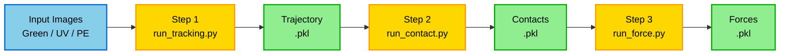

# TPE_Disk_Image_Processing


This pipeline automates the full analysis workflow of a 2D granular experiment using photoelastic disks — from raw experimental images to a complete force network — combining deep learning (StarDist, ResNet) with physics-based optimization under mechanical equilibrium constraints. While the overall flow is similar to the famous PEGs algorithm, the custom-trained networks help circumvent the inevitable residual stress in wet disks that would have rendered the $G^2$ method useless.
 
This repository contains a three-step image analysis pipeline for tracking photoelastic disks, detecting contacts, and computing force vectors in granular material experiments.

Below is a quick overview of the package and quick starts. For details, refer to: https://linjunjr.github.io/TPE_Disk_Image_Processing/

<table><tr>
<td></td>
<td></td>
</tr></table>


*Left: experimental image. Right: Reconstructed image from the extracted particle positions and forces.*

## Workflow Overview


```mermaid
graph LR
    I[Input Images<br/>Green / UV / PE] 
    S1[Step 1<br/>run_tracking.py]
    O1[Trajectory<br/>.pkl]
    S2[Step 2<br/>run_contact.py]
    O2[Contacts<br/>.pkl]
    S3[Step 3<br/>run_force.py]
    O3[Forces<br/>.pkl]
    
    I --> S1 --> O1 --> S2 --> O2 --> S3 --> O3
    
    classDef input fill:#87CEEB,stroke:#0066cc,stroke-width:2px,color:#000
    classDef process fill:#FFD700,stroke:#ff9900,stroke-width:2px,color:#000
    classDef output fill:#90EE90,stroke:#00aa00,stroke-width:2px,color:#000
    
    class I input
    class S1,S2,S3 process
    class O1,O2,O3 output
```

The analysis pipeline consists of three sequential CLI scripts driven by YAML configuration files. The scripts process experimental images (green fluorescence, UV orientation markers, photoelastic PE images) to extract particle trajectories and force networks:

<table><tr>
<td></td>
<td></td>
<td></td>
</tr></table>


## Pipeline Steps

### Step 1: Disk Tracking with StarDist
**Script:** `run_tracking.py`  
**Environment:** `stardist_env`

Automated detection and tracking of disks using StarDist 2D: https://github.com/stardist/stardist

**Key Features:**
- Disk detection using pre-trained StarDist2D model
- Particle linking into trajectories using Trackpy
- Rotation angle computation via PCA on disk orientation markers
- Per-particle G² computation from PE images
- Boundary particle identification

**Inputs:**
- Green-channel fluorescence images (`green_*.png`) for disk detection
- UV/blue-channel images (`blue_*.png`) for orientation tracking
- PE images (`bw_*.png`) for per-particle G² computation
- StarDist model for disk segmentation

**Outputs:**
- Pickle file containing:
  - Particle positions (x, y) for each frame in pixels
  - Particle IDs and trajectories
  - Disk radii (rpx) in pixels
  - Angular positions (theta)
  - Per-particle G² values
  - Boundary particle tags

### Step 2: Contact Detection
**Script:** `run_contact.py`  
**Environment:** `torch_env`

Identifies and classifies contacts between particles using a trained CNN model.

**Key Features:**
- Neighbor detection based on distance threshold
- Contact classification using neural network

**Inputs:**
- Trajectory pickle file from Step 1
- PE images
- Pre-trained contact detection model

**Outputs:**
- Contact dataframe with:
  - Contact pairs (i, j)
  - Contact positions (xi, yi, xj, yj)
  - Contact angles (beta)
  - Classification scores

### Step 3: Force Vector Computation
**Script:** `run_force.py`  
**Environment:** `torch_env`

Computes force magnitudes and directions at each contact using photoelastic image analysis and optimization.

**Key Features:**
- Initial force guess using ResNet regression model
- Force optimization with equilibrium constraints (∑F=0, ∑τ=0)

**Inputs:**
- Contact data from Step 2
- Photoelastic images
- Pre-trained force prediction model

**Outputs:**
- Force vectors (magnitude and angle) at each contact
- Total force on each particle

## Setup

### Environment Overview

This pipeline uses **two separate conda environments** due to TensorFlow 2.10's native Windows GPU requirement (NumPy 1.x ABI) conflicting with PyTorch 2.x (NumPy 2.x):

| Environment | Notebook | GPU backend | Key packages |
|---|---|---|---|
| `stardist_env` | 01 — Disk tracking | TF 2.10 + CUDA 11.2 | TensorFlow-GPU, StarDist, CSBDeep, Trackpy |
| `torch_env` | 02 — Contact detect<br/>03 — Force solve | PyTorch + CUDA 12.6 | PyTorch 2.6+cu126, Torchvision |


### Installation

**Create both environments:**
```bash
cd environments/
conda env create -f stardist_env.yml
conda env create -f torch_env.yml
```

**Prerequisites for `stardist_env` GPU support:**
- NVIDIA driver ≥ 450.80.02
- CUDA 11.2 system libraries (installed automatically via `cudatoolkit=11.2`)

**Prerequisites for `torch_env` GPU support:**
- NVIDIA driver ≥ 525.0 (for CUDA 12.6)
- PyTorch CUDA libraries are bundled in the pip wheel — no system CUDA install needed

### Kernel Selection

When opening a notebook in VS Code / JupyterLab, select the matching kernel:

- **Notebook 01** → select `stardist_env` kernel
- **Notebooks 02 & 03** → select `torch_env` kernel

## Quick Start

### Configuration

All pipeline parameters are controlled via two YAML configuration files:

- **`dynamic_config.yaml`** — Experiment-specific settings (paths, experiment folder, frame selection, GPU workers)
- **`stationary_config.yml`** — Static parameters (model paths, ROI, detection thresholds, fitting hyperparameters)

**Edit `dynamic_config.yaml` before running:**

```yaml
paths:
  data_dir: "N:/PROJ_TPE"
  pkl_dir: "M:/Archive/Proj_TPE/Disk_traj_files"
  bond_dir: "M:/Archive/Proj_TPE/Contact_bond_files"
  force_dir: "M:/Archive/Proj_TPE/Force Inversion"

experiment:
  exp_folder: "TPE_20260807A01_N=262x2_stop_go_1e-3rpsx200s_stop1000s_1000framesx1fps_20reps"
```

### Running the Pipeline

Activate the appropriate conda environment and run each step sequentially:

```bash
# Step 1: Disk tracking
conda activate stardist_env
python run_tracking.py --config dynamic_config.yaml

# Step 2: Contact detection
conda activate torch_env
python run_contact.py --config dynamic_config.yaml

# Step 3: Force computation
python run_force.py --config dynamic_config.yaml
```

### CLI Overrides

Override config values from the command line without editing the YAML:

```bash
# Override experiment folder
python run_tracking.py --config dynamic_config.yaml --exp-folder TPE_20260808A02_...

# Process only first 10 frames
python run_tracking.py --config dynamic_config.yaml --frame-mode first --frame-value 10

# Use 8 GPU workers for force fitting
python run_force.py --config dynamic_config.yaml --gpu-workers 8

# Dry run (validate config without processing)
python run_tracking.py --config dynamic_config.yaml --dry-run
```

### Batch Processing

Process multiple experiments in a loop:

**PowerShell:**
```powershell
$experiments = @(
    "TPE_20260808A01_N=262x2_e-5rps",
    "TPE_20260808A02_N=262x2_2e-5rps",
    "TPE_20260808A03_N=262x2_5e-5rps"
)

foreach ($exp in $experiments) {
    python run_tracking.py --config dynamic_config.yaml --exp-folder $exp
    python run_contact.py --config dynamic_config.yaml --exp-folder $exp
    python run_force.py --config dynamic_config.yaml --exp-folder $exp
}
```

**Bash:**
```bash
for exp in TPE_20260808A01_... TPE_20260808A02_... TPE_20260808A03_...; do
    python run_tracking.py --config dynamic_config.yaml --exp-folder "$exp"
    python run_contact.py --config dynamic_config.yaml --exp-folder "$exp"
    python run_force.py --config dynamic_config.yaml --exp-folder "$exp"
done
```

### Notebook Demos

Interactive Jupyter notebooks are available in the `Notebooks/` folder for testing and visualization:

- `01. TPE_disk_tracking_stardist.ipynb`
- `02. TPE_contact_detect.ipynb`
- `03. TPE_solve_force_vector.ipynb`

These notebooks demonstrate the same workflow interactively but are not recommended for batch processing.

