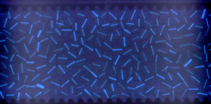

# Finding Orientation Angles

<figure>
  
</figure>

Disk orientation is determined by analyzing the blue channel image, which contain a fluorescent line on each disk. The process is automated in the [compute_frame_orientations](https://github.com/linjunJR/TPE_Disk_Image_Processing/blob/main/src/orientation.py#L111) function. Below briefly describr the workflow:

1. **Crop a patch** around each detected disk centroid in the blue channel image.
2. **Threshold** the patch to get rid of background noise and isolate the marker pixels.
3. **Principal Component Analysis (PCA)** is applied via [orientation_weighted_pca](https://github.com/linjunJR/TPE_Disk_Image_Processing/blob/main/src/orientation.py#L24) to the marker pixels to find the major axis, which gives the disk's rotation angle $\theta$.

This angle is stored in the output dataframe for each particle and frame.

To avoid a pi degeneracy, the angles are defined using the [compute_continuous_angles](https://github.com/linjunJR/TPE_Disk_Image_Processing/blob/main/src/orientation.py#L67) function, such that the orientation rotates continuously from frame to frame, without any sudden jumps between 0 and pi. This is done by comparing the two possible angles ($\theta$ and $\theta+\pi$) to the previous frame's $\theta$, and choosing the one that is closer. 