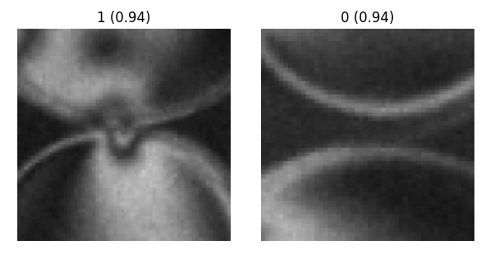

# Contact Detection

Contact detection happens in two stages: a cheap geometric neighbour search that proposes candidate contacts, followed by a CNN classifier that decides which candidates are real.

## Stage 1 — Neighbour search

For each frame, every pair of particles within a distance threshold is treated as a candidate contact. The threshold is \(r_i + r_j + d_{tol}\), where \(r_i\) and \(r_j\) are the two disk radii and \(d_{tol}\) is set to 10 pixels — a value chosen for a reasonable trade-off between runtime and completeness. Raising \(d_{tol}\) pulls in more candidates to classify (slower), while lowering it risks missing real contacts.

Two indexing rules keep this manageable: disks on the boundary are marked `boundary=True` and can only appear as the `j` disk in a pair, so they're never contacted by other boundary disks and never contact anything themselves. And each `ij` pair is counted once rather than twice, since checking it in both directions would double the classification workload for no benefit.

## Stage 2 — CNN classification

Each candidate pair is cropped into a small patch centered on the contact:

(the patch on the left shows a real contact; the one on the right doesn't). These patches are passed through a ResNet18 classifier trained on human-labelled examples from experiments. The model outputs a confidence score per candidate, and anything above 0.5 is kept as a detected contact.

After classification, contacts between two bulk disks are duplicated into their reciprocal `ji` pair for convenience downstream; boundary contacts aren't duplicated since they're directional by definition. One more cleanup step: the force-inversion step (Step 3) can't handle a disk that has only one contact, since a single contact can't be in equilibrium. Any such pair is flagged `singular` so it can be filtered out. This is rare, but it's checked for robustness regardless.

## Model Architecture

The classifier used in Step 2 (`run_contact.py`) is a binary ResNet18:

- **Classes:** `0` = non-contact, `1` = contact
- **Backbone:** `torchvision.models.resnet18(weights=None)` at inference, with weights loaded from the trained checkpoint (`models/ResNet18_contact_finetuned.pth`)
- **Head:** `Linear(512→1024) → ReLU → Dropout(0.5) → Linear(1024→2)`

Before inference (in `src.predict_contact_batch`), each candidate patch is cropped tangent to the contact, resized to 128×128, converted from grayscale to 3-channel RGB, scaled to `[0, 1]`, and normalized with ImageNet statistics. The model outputs two logits, converted to softmax probabilities; the pipeline keeps `contact = argmax(probabilities)` and `prob = max(probabilities)`, and only candidates predicted as class `1` move on to force inversion.
 

 ## Training params
 The model stored in [models](https://github.com/linjunJR/TPE_Disk_Image_Processing/tree/main/models) is trained with around 14K human-labelled examples from experiments. 
Data augmentation techniques such as random flips and brightness adjustments are applied to improve generalization. The dataset is split into 80% train, 20% validation. The model's head is first warmed up for 200 epochs with a batch size of 32, using the Adam optimizer with a learning rate of 1e-3. The whole model is then fine-tuned for 200 with a learning rate of 1e-6. 