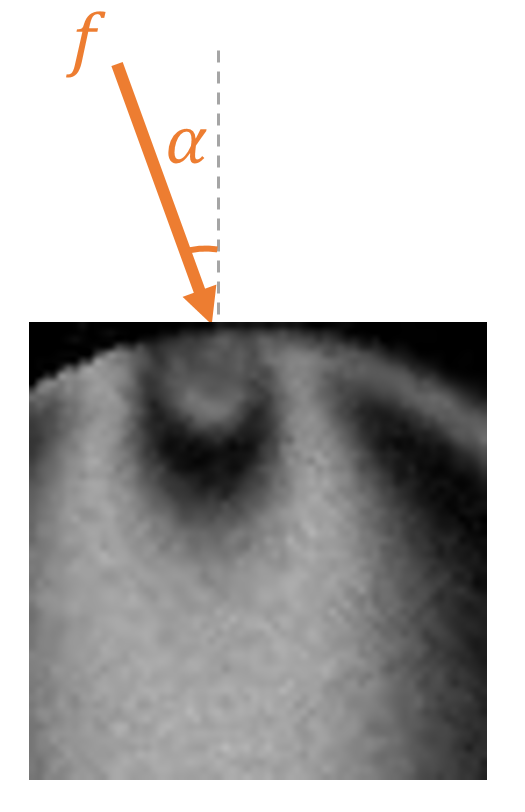

# Contact Force Initial Guess

## Goal

For each detected contact region, the model predicts a force magnitude \(f\) (`force_pred`) and a contact angle \(\alpha\) (`angle_pred`):

These predictions are used as warm-start initial guesses for the [physics-constrained optimizer](https://linjunjr.github.io/TPE_Disk_Image_Processing/force-solve/), which then searches for the best solution. The guess isn't expected to be perfect — it just needs to be close enough to the true solution that the optimizer converges faster and avoids bad local minima.

## Why warm start matters

The inverse problem in [Step 3](https://linjunjr.github.io/TPE_Disk_Image_Processing/step3-force/) is non-convex, so starting from a random `(f, alpha)` is both slower and more likely to end in a poor local minimum — a good starting point matters. The original PeGS implementation uses \(G^2\) as an initial guess, but that fails under residual stress and gives no angle information at all. The ResNet guess is more robust: it usually lands the optimizer in a physically plausible basin from the start.

## Training data generation

Given a specific contact force vector, one cannot determine the fringes at the contact region because other contacts on that disk also contribute to the fringe pattern. Thus, when generating the synthetic training data, we need to first generate a set of random contact force vectors, put them on random locations on the perimeter of a disk, and generate the corresponding fringes of the whole disk. Contact regions are then cropped out from the disk images and used for training. 

There are various physical constraints on the possible combinations of contact forces on a disk, such as equilibrium and friction. In addition, the choice of random distribution used to sample the force magnitudes and angles affects the model performance, and should be chosen with care. We largely follow the principles and methods proposed in [Renat Sergazinov and Miroslav Kramár 2021 Mach. Learn.: Sci. Technol. 2 045030](https://dx.doi.org/10.1088/2632-2153/ac29d5). The range of force magnitudes largely falls between 0.01 to 5 N. 

## The Model
 
The force-initialization network is a two-output ResNet18 regressor built in `src/force.py` via `get_model(device, output_dim=2)`.
 
| Component | Detail |
|---|---|
| Backbone | ResNet18, ImageNet-pretrained |
| Head | `Linear(512→256) → ReLU → Dropout(0.2) → Linear(256→2)` |
| Output | `[force_pred, angle_pred]` |
| Training schedule | Backbone frozen during warmup, then unfrozen for fine-tuning |

## Training params

The  model saved in [models](https://github.com/linjunJR/TPE_Disk_Image_Processing/tree/main/models) is trained with 30000 synthetic images of contact regions that are cropped from disks subject to random forces. The model's head is first warmed up for up to 1000 epochs with a batch size of 32, using the Adam optimizer with a learning rate of $10^{-4}$, then fine-tuned for 1000 epochs with a learning rate of $10^{-6}$. 