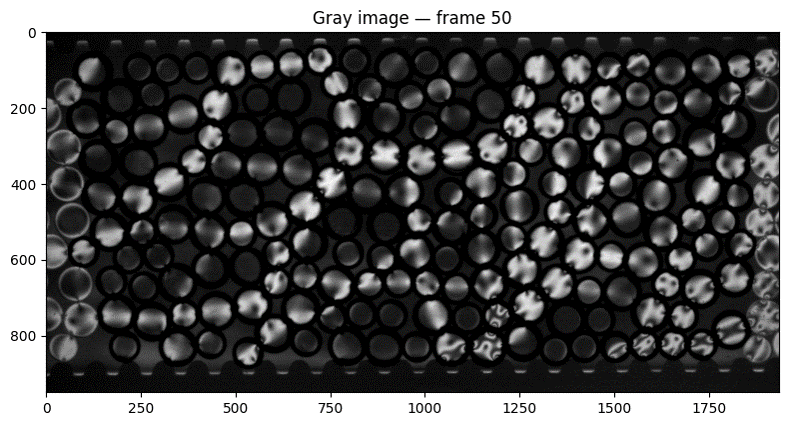

# Finding $G^2$

The bright rim on images made $G^2$ an unreliable tool for contact detection and force estimation. However, we found that by softly masking out the rims of each disk, the sum of $G^2$ is still closely correlated with the boundary force measurement, suggesting it could still be used as a proxy for scalar stress on each grain.
 Below are the steps to compute $G^2$ for each disk in the PE image.

## How $G^2$ is computed

1. To mask out the bright rim from the fluids, subtract Gaussian rings around particle centers using [`src.subtract_gaussian_rings`](https://github.com/linjunJR/TPE_Disk_Image_Processing/blob/main/src/utils.py#L305).
Below is an example of the masked image:

2. Crop out each disk in the PE image and compute the squared gradient of the intensity (using [`compute_G2_map`](https://github.com/linjunJR/TPE_Disk_Image_Processing/blob/main/src/utils.py#L290)).

3. **Average** the squared gradient values within the circular region of the disk to get a single $G^2$ value for each disk. Write to the resulting dataframe.
