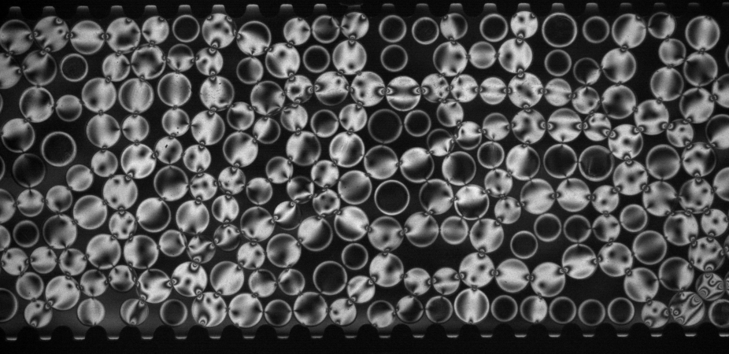
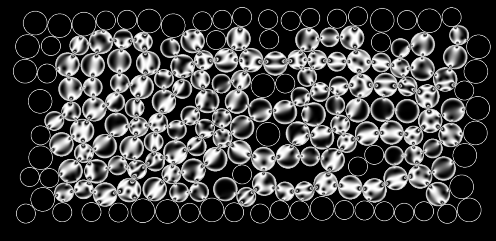
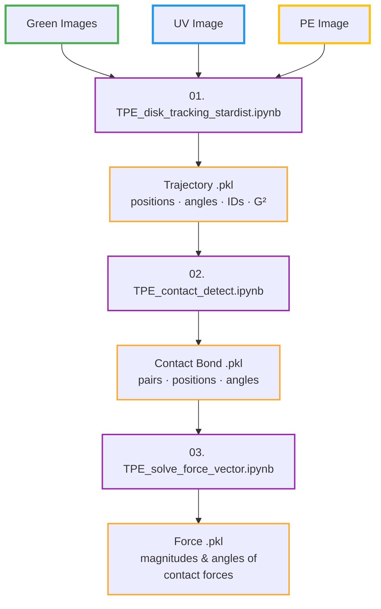

# TPE Disk Image Processing

This pipeline automates the full analysis workflow of a 2D granular experiment using **photoelastic disks** — from raw experimental images to a complete force network. It combines deep learning (StarDist, ResNet) with physics-based optimization under mechanical equilibrium constraints.

The approach is largely inspired by the established [PeGS algorithms](https://github.com/photoelasticity/PeGS2). But PeGS largely relies on a nice monotonic $G^2$ calibration curve. Wet photoelastic disks inevitably develop residual stress, which renders the classical $G^2$ method unusable. The custom-trained neural networks here are designed to work around this limitation.

  

    
    
<em>Raw experimental image</em>

  

  

    
    
<em>Reconstructed from extracted positions & forces</em>

  

---

## Workflow Overview

The pipeline consists of three main steps, each implemented as a Jupyter notebook. Each step results in a pickle file `.pkl` that stores a Pandas dataframe. The outputs of one step are the inputs to the next.

| Step | Notebook | Environment | Output |
|------|----------|-------------|--------|
| 1 | [`01. TPE_disk_tracking_stardist.ipynb`](https://nbviewer.org/github/jctsaigroup/TPE-Disk-Image-Processing/blob/main/01.%20TPE_disk_tracking_stardist.ipynb) | `stardist_env` | Trajectory `.pkl` |
| 2 | [`02. TPE_contact_detect.ipynb`](https://nbviewer.org/github/jctsaigroup/TPE-Disk-Image-Processing/blob/main/02.%20TPE_contact_detect.ipynb) | `torch_env` | Contact bond `.pkl` |
| 3 | [`03. TPE_solve_force_vector.ipynb`](https://nbviewer.org/github/jctsaigroup/TPE-Disk-Image-Processing/blob/main/03.%20TPE_solve_force_vector.ipynb) | `torch_env` | Force `.pkl` |
| 3 (CPU) | [`03. TPE_solve_force_vector_CPU.ipynb`](https://nbviewer.org/github/jctsaigroup/TPE-Disk-Image-Processing/blob/main/03.%20TPE_solve_force_vector_CPU.ipynb) | `torch_env` | Force `.pkl` (no GPU required) |

For batch/automated runs across many experiments, see the [Batch Script](batch-script.md) page.
