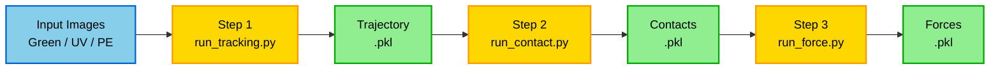

# TPE Disk Image Processing

This document describes the workings of the [TPE_Disk_Image_Processing](https://github.com/linjunjr/TPE-Disk-Image-Processing) project, which automates the full analysis workflow of a 2D granular experiment using **photoelastic disks** — from raw experimental images to a complete force network. It combines deep learning (StarDist, ResNet) with physics-based optimization under mechanical equilibrium constraints.

The approach is largely inspired by the established [PeGS algorithms](https://github.com/photoelasticity/PeGS2). But PeGS largely relies on a nice monotonic $G^2$ calibration curve. Wet photoelastic disks inevitably develop residual stress, which renders the classical $G^2$ method unusable. An empirical form for the residual stress as well as custom-trained neural networks are deployed to work around this limitation.

  

    
    
<em>Raw experimental image</em>

  

  

    
    
<em>Reconstructed from extracted positions & forces</em>

  

---

## Workflow Overview

The pipeline consists of three main steps, each implemented as a CLI script driven by YAML configuration. Each step produces a pickle file `.pkl` containing a Pandas dataframe. The outputs of one step are the inputs to the next.

| Step | Script | Environment | Output |
|------|--------|-------------|--------|
| 1 | `run_tracking.py` | `stardist_env` | Trajectory `.pkl` |
| 2 | `run_contact.py` | `torch_env` | Contact bond `.pkl` |
| 3 | `run_force.py` | `torch_env` | Force `.pkl` |

**Notebooks for Demo/Testing:**  
Interactive Jupyter notebooks demonstrating each step are available in the `Notebooks/` folder:

- [`01. TPE_disk_tracking_stardist.ipynb`](https://nbviewer.org/github/jctsaigroup/TPE-Disk-Image-Processing/blob/main/Notebooks/01.%20TPE_disk_tracking_stardist.ipynb)
- [`02. TPE_contact_detect.ipynb`](https://nbviewer.org/github/jctsaigroup/TPE-Disk-Image-Processing/blob/main/Notebooks/02.%20TPE_contact_detect.ipynb)
- [`03. TPE_solve_force_vector.ipynb`](https://nbviewer.org/github/jctsaigroup/TPE-Disk-Image-Processing/blob/main/Notebooks/03.%20TPE_solve_force_vector.ipynb)

These are useful for visualization and testing but not recommended for batch processing.
