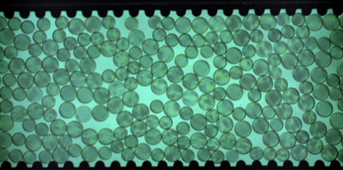
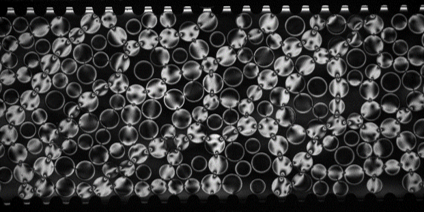
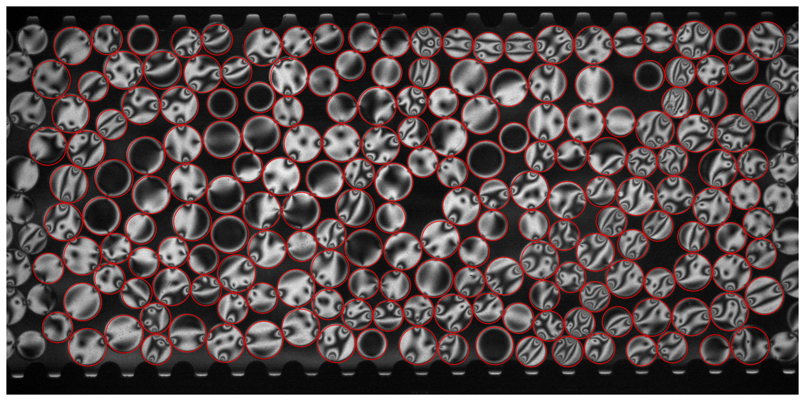

# Step 1 — Disk Tracking with StarDist

**Notebook:** [`01. TPE_disk_tracking_stardist.ipynb`](https://nbviewer.org/github/jctsaigroup/TPE-Disk-Image-Processing/blob/main/01.%20TPE_disk_tracking_stardist.ipynb)  
**Kernel:** `stardist_env`

This notebook detects and tracks photoelastic disks across all frames using a pre-trained [StarDist2D](https://github.com/stardist/stardist) segmentation model, then computes orientation angles from the UV fluorescent image, and per-particle $G^2$ values from the PE images as well.

  

    
    <em>Green channel — disk positions</em>
  

  

    
    <em>UV channel — orientation markers</em>
  

  

    
    <em>PE image — photoelastic fringes</em>
  

---

## What the notebook does

### 1. Disk detection ([StarDist2D](stardist.md))
Each green-channel frame is fed to the StarDist2D model, which returns star-convex polygon instances for every disk. Centroids and radii (`rpx`) are extracted from the instance labels.

### 2. Particle linking ([Trackpy](https://soft-matter.github.io/trackpy/))
Detected centroids are linked across frames into trajectories using [Trackpy](http://soft-matter.github.io/trackpy/). Short gaps (single missing frames) are filled by linear interpolation via `interpolate_pos_angle`.

### 3. [Rotation angle via PCA](angles.md)
For each detected disk in each frame, the UV-channel patch around the centroid is thresholded and the orientation marker is located. PCA on the marker pixels gives the disk rotation angle `theta`.

### 4. DoG Refinement of disk centers for improved tracking accuracy

### 5. Per-particle G²
The PE image is cropped around each disk and the mean squared gradient ($G^2$) is computed as a proxy for stress magnitude.

---

## Outputs

A single pickle file is saved containing a `pandas.DataFrame` with one row per *(particle, frame)* pair:

| Column | Description |
|---|---|
| `particle` | Unique particle ID |
| `frame` | Frame index |
| `x`, `y` | Centroid position (pixels) |
| `rpx` | Disk radius (pixels) |
| `angle` | Rotation angle (radians) |
| `g2` | Per-particle $G^2$ value |
| `boundary` | `True` if boundary particle |

---

## Step-by-step instructions

We choose the black-white camera as the standard frame of reference. So the first thing is to make sure is the camera calibration matrix looks alright. This is used to convert the perspective of the colored camera to the monochrome camera, so that we can track the disks in the green channel and then map those positions perfectly to the standard reference frame of the PE images.

So go ahead and run the first few cells. Remeber to change the ``IMG_DIR`` and ``EXP_FOLDER`` accordingly. 
After the tracking is done, check the diagnostic figures to make sure the tracking looks good:

Some red circles might look slightly off, which is fine. Just make sure there are no systematic shifts or scaling issues that points to a bad calibration. If that's the case, you must update the calibration matrix by redoing the chessboard calibration demonstrated in [This notebook](https://github.com/linjunJR/TPE-Disk-Image-Processing/blob/main//TPE_2cam_calib.ipynb), and update the homography matrix in the `camera_align` function.

If you're lucky and the tracking looks good, move on to run the next cell that links the detected positions into trajectories. Here you have the option to track in separate segments if your experiment is not one continuous series of frames, but several trials that are filmed into one folder and should be tracked separately. Adjust the ``N_SEGMENTS`` and ``FRAMES_PER_SEG`` accordingly. The particle trajectories in different trials will not be continuous, and particle indices will be shifted by a large number between trials so ids aren't reused across trials. If your experiment is one continuous recording, just set ``N_SEGMENTS=1`` and it will track all frames together.

From here on all the following cells can be run in one go. No input params needed. Just check the random diagnostic figures to make sure the angles and G² values look reasonable. If all looks good, you should have your trajectory pickle saved and we can move on to Step 2.

Check out the How-it-Works of [Stardist](stardist.md), [Angle detection](angles.md), and [G² calculation](g2.md) in the notebook for more details on the methods and algorithms.
